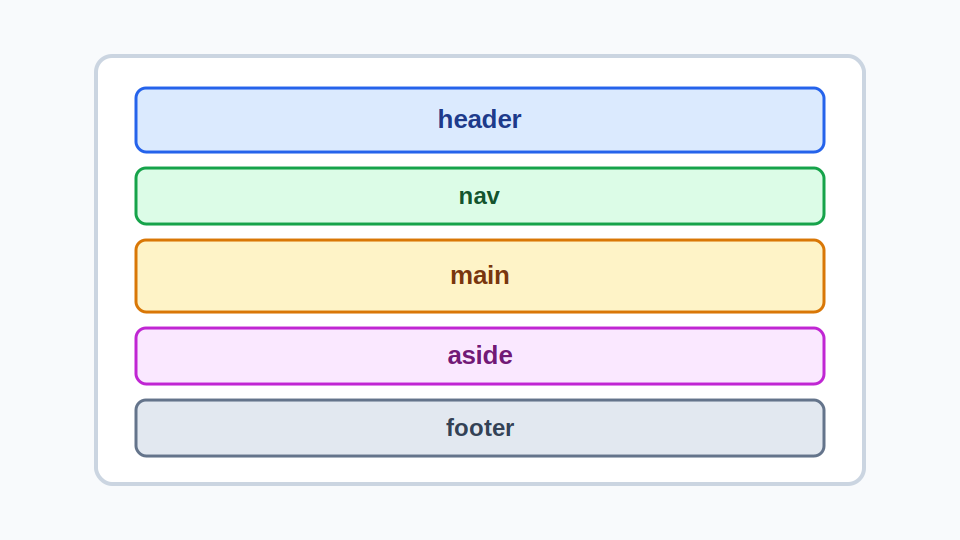

# The Solid Foundation of Semantic HTML

Web Design 3 is about building small hand-crafted websites that are clearly planned, semantically built, and intentionally styled.



<Note>
  Good layout starts before CSS. A clear semantic structure will beautifully
  scaffold your design work.
</Note>

## What Web Design 3 Covers

**Our focus:**

- semantic HTML
- accessible document structure
- readable base CSS
- practical Grid and Flexbox layout
- fluid responsive design
- testing
- simple static deployment (netlify!)

_**Not the focus:** seo, analytics, javascript app dev_

## Our Build Process Goal

**Full Build Process:**

1. Structure the content.
2. Mockup the design.
3. Style readable defaults.
4. Craft intentional layouts.
5. Add responsive fluidity.
6. (re)Organize CSS.
7. Test the site.
8. Deploy!

<Practice>Always treat planning as part of the build process.</Practice>

## SNEEK PEEK: Assignment 1

Assignment 1 asks you to plan the brochure website you will build in Assignment 2.

Your plan should include:

- content and page structure
- a semantic HTML outline
- basic accessibility notes
- desktop visual direction

<Note>
  A strong A1 will clearly demonstrate an understanding of your content and its
  required structure.
</Note>

## Our _Simplified_ A1 & A2 Build Process

**Assignment One:**

1. Structure the content.
2. Mockup the design.

**Assignment Two:**

1. Style readable defaults.
2. Craft intentional layouts.
3. Test the site.

## Information Architecture

Good layout starts as reading order, grouping, and hierarchy.

Before choosing Grid, Flexbox, spacing, or colours, decide:

- what the page is about
- what belongs together
- what order the content should be read in
- which parts are global site structure
- which parts are unique page content

## Structure Before Style

HTML describes the meaning and organization of content. CSS describes presentation.

```html
<article>
  <h2>Guided Walking Tours</h2>
  <p>Join a local guide for a two-hour tour.</p>
  <a href="tours.html">View walking tour times</a>
</article>
```

<Warning>
  Don't choose headings, lists, or buttons based on how they look by default.
  Match elements to the content's job.
</Warning>

## Element Choices Should Match Content

The previous example works because each element has a clear job:

- `<article>` groups a self-contained content item.
- `<h2>` introduces the item.
- `<p>` contains paragraph text.
- `<a>` uses plain language to say where it goes.

```html
<article>
  <h2>Guided Walking Tours</h2>
  <p>Join a local guide for a two-hour tour.</p>
  <a href="tours.html">View walking tour times</a>
</article>
```

## Diagnostic Questions

Before mockups and markup ask:

- What is the page about?
- What content is global to the site?
- What content is unique to this page?
- What is the main content?
- Which sections need headings?
- Which links must be clear out of context?
- Which images communicate information?

<Practice>
  Remove all CSS and ask whether a page still reads in a logical order. _In
  Practice: [CSS Naked Day](https://css-naked-day.org/)_
</Practice>

## Page Anatomy

Most small brochure pages have a familiar structure:

```text
body
  header
    site name
    navigation
  main
    h1
    content sections
  footer
```

<Note>
A page should usually have one `<main>` element, a landmark for the content unique to that page.
</Note>

## Page Anatomy In HTML

```html
<body>
  <header>
    <a href="/">Assiniboine Park</a>
    <nav>...</nav>
  </header>

  <main>
    <h1>Plan Your Visit To Assiniboine Park</h1>
    <section>
      <h2>What To See</h2>
      <p>Explore gardens, trails, and events.</p>
    </section>
    <section>
      <h2>What To Feel</h2>
      <p>Explore feelings and sensations.</p>
      <h3>When To Feel</h3>
      <p>Any day. Any time.</p>
    </section>
  </main>

  <footer>...</footer>
</body>
```

## Landmarks

Landmarks identify major page regions:

- `<header>` for introductory site or section content
- `<nav>` for major navigation links
- `<main>` for the page's primary content
- `<aside>` for related or complementary content
- `<footer>` for closing site or section information

<Warning>
  More landmarks do not automatically mean better accessibility. Use landmarks
  when they identify real regions.
</Warning>

## Headings Create The Outline

Headings describe the page outline. A user should be able to skim the headings and understand what the page contains.

```html
<h1>Plan Your Visit To Assiniboine Park</h1>

<section>
  <h2>Hours And Admission</h2>
  <p>The park is open daily, free of charge.</p>
</section>
<section>
  <h2>Frequently Asked Questions</h2>
  <p>What is the meaning of life?</p>
</section>
```

<Practice>
  Write headings as labels for real content sections, not as decoration.
</Practice>

## Nested Headings

Use nested headings when content belongs inside a larger section:

```html
<section>
  <h2>Featured Attractions</h2>
  <article>
    <h3>The Leaf</h3>
    <p>Visit indoor biomes, gardens, and exhibits.</p>
  </article>
  <article>
    <h3>Leo Mol Sculpture Garden</h3>
    <p>Walk through sculptures and landscaped paths.</p>
  </article>
</section>
```

Headings should not skip levels for visual effect.

## Sectioning Content

Use sectioning elements when they clarify the content model:

- `<section>` for a thematic part of a page that needs a heading
- `<article>` for content that could stand alone or be reused
- `<aside>` for related content that supports nearby content
- `<div>` only when you really need a styling hook

<Warning>
It is easy to overuse `<section>` because it sounds more meaningful than `<div>`. If you cannot write a useful heading for the group, it may not need to be a section.
</Warning>

## Messy to Bestie

<SemanticStructureDemo />

## After The Skeleton

Once the page skeleton is clear, choose elements that match specific brochure content.

There are so many lovely helpful semantic elements to choose from:

<SemanticElementsDemo />

## Elements First, Classes Second

Classes are still important, but they should not replace meaningful elements.

```html
Instead of this:
<a href="http://glutton-farm.ca" class="button">Visit our Bountiful Archeage</a>

Try this:
<a href="http://glutton-farm.ca">
  <button>Visit our Bountiful Archeage</button>
</a>
```

<Practice>Use and style native elements before adding classes.</Practice>

## Classes For Variants

```html
<a href="http://glutton-farm.ca">
  <button>Visit our Bountiful Archeage</button>
</a>

<a href="http://glutton-farm.ca">
  <button class="secondary">Visit our Bountiful Archeage</button>
</a>

<a href="http://glutton-farm.ca">
  <button class="call-to-action">Visit our Bountiful Archeage</button>
</a>
```

## Styling Structural Variants

Semantic structure gives CSS meaningful regions to style.

```html
<main>
  <section class="hero">...</section>
  <section class="card-grid">...</section>
  <section class="visit-info">...</section>
</main>
```

## Assignment 1 First Steps

1. Look for inspiration!
2. Pick your target location.
3. For both planned pages, identify:
   - the page's purpose
   - the main `h1`
   - the major content sections
   - likely landmarks
   - repeated navigation
   - image needs and possible alt text decisions
   - links that need clear destination text

You are not designing every layout decision yet. You are identifying the structure the future layout will depend on.

<Note>
  Assignment One is a plan that should make Assignment Two easier to start and
  build.
</Note>

## A Useful Semantic Plan

A semantic plan can be a nested list or simplified HTML skeleton.

```text
Page 1: Main brochure page
header
  site name linking home
  main navigation
main
  h1: Visit Gimli, Manitoba
  section: Why visit Gimli
  section: Lakefront activities
  section: Festivals and events
  section: Local food and shops
footer
  source credits
  secondary links
```

<Practice>
  Before moving to Figma, read the structure plan from top to bottom.
</Practice>

## Week 1 Check

By the end of this week, you should be able to:

- explain why semantic HTML comes before layout
- identify common page landmarks
- create one logical `h1`
- organize sections with meaningful headings
- rewrite generic markup into meaningful HTML
- connect semantic planning to Assignment 1

```text
If all CSS failed to load, would the page still make sense?
```
